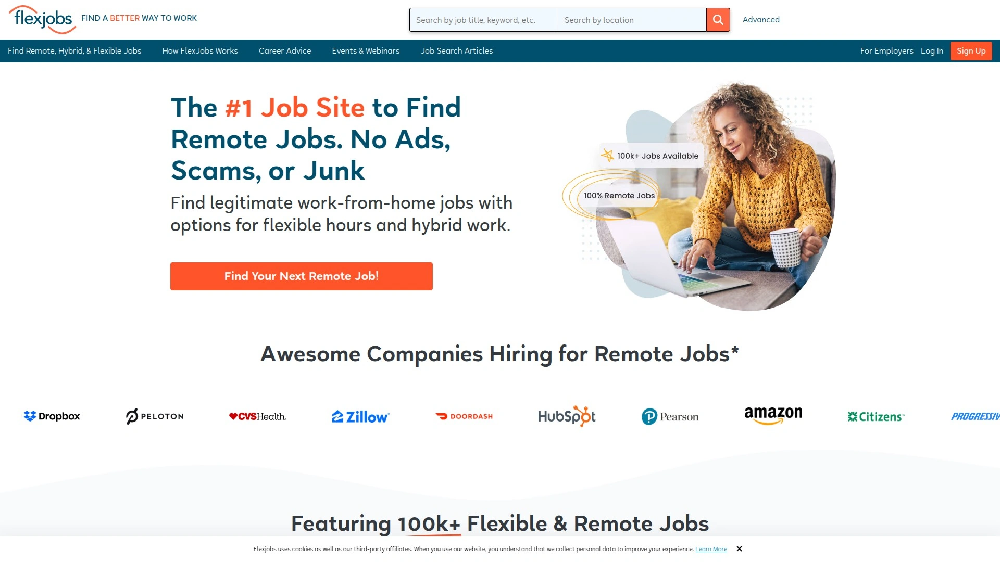

# 学会使用这13个求职招聘平台,三分钟搞定职位搜索

找工作时总是在多个网站之间切换,简历投了几十份却石沉大海,不知道哪些平台的职位更靠谱?现在有一批专业的求职搜索引擎和招聘平台,能帮你聚合数千家招聘网站的职位信息,提供薪资透明度对比、公司评价、远程工作筛选等实用功能。这份榜单整理了13个值得关注的求职招聘平台,覆盖综合类、远程工作、政府职位、行业细分等不同场景,帮你更高效地找到合适的工作机会。

***

## **[Careerjet](https://careerjet.com)**

全球覆盖90+国家的职位搜索引擎聚合平台。

Careerjet是一个专门设计用来简化网上找工作过程的求职搜索引擎,通过聚合来自招聘网站、猎头公司网站和大型专业招聘平台的职位信息,把分散在互联网上的海量职位整合到一个统一的数据库里。用户不需要逐个访问每个招聘网站,只要在Careerjet上搜索就能看到所有相关职位。

平台本身不托管职位信息,所有职位链接都会跳转到原始发布网站。这种模式让Careerjet充当流量驱动器的角色,为那些小型招聘机构或企业网站带去更多曝光。Careerjet每天扫描超过58000个网站,自动识别和索引新发布的职位,确保数据库始终保持更新。

**覆盖范围:** Careerjet的求职搜索引擎网络覆盖90多个国家,提供28种语言界面。无论你在寻找美国本土工作、欧洲职位还是亚洲机会,都能在统一的搜索界面里找到。可以按关键词、地点、公司名称进行搜索,支持设置邮件提醒,当有符合条件的新职位时自动通知。

移动应用在iOS和Android平台都可免费下载,支持创建求职者账户后保存搜索记录、上传简历、定制邮件提醒等功能。整个服务对求职者完全免费,无需注册即可浏览和申请职位。特别适合希望一次性搜索多个来源、不想遗漏任何机会的求职者,以及需要跨国或跨地区找工作的人群。

***

## **[LinkedIn Jobs](https://www.linkedin.com/jobs)**

全球最大的职场社交平台和招聘网络。

LinkedIn不只是个职位搜索网站,更是一个包含8.3亿专业人士的职场生态系统。平台最大的优势是能接触到被动求职者——那些目前有工作但对新机会保持开放态度的人。LinkedIn上83%的发布职位在24小时内就能收到合格候选人的申请,这个效率在招聘行业里处于领先水平。

职位推荐系统基于你的个人资料、技能背书、工作经历和网络连接,智能匹配最相关的工作机会。你能看到每个职位有多少人申请、自己是否属于"顶级申请人"、公司里是否有一度或二度人脉联系,这些信息帮你评估申请成功率和是否值得投入时间。

LinkedIn Premium Career订阅提供更多求职工具,包括AI驱动的简历优化建议、职位匹配洞察、高级搜索过滤器。你可以用InMail直接联系招聘经理,即使不在对方的联系人列表里。数据显示Premium Career订阅者平均获得雇用的概率是普通用户的2.6倍,个人资料浏览量高出11倍。

平台还整合了超过21000门LinkedIn Learning课程,可以边找工作边提升技能。对于重视人脉网络、希望被猎头主动发现、需要长期职业发展规划的职场人士来说,LinkedIn是必备工具。

***

## **[Indeed](https://www.indeed.com)**

职位数量最多的综合类求职搜索引擎。

Indeed每秒有12个新职位发布到平台上,数据库包含数百万个岗位,覆盖所有行业和经验级别。作为全球最大的求职网站之一,Indeed的核心优势是职位覆盖广度——不仅包含自己平台上发布的职位,还聚合了其他招聘网站、公司官网、报纸分类广告等来源的招聘信息。

简历工具允许你上传现有简历或使用Indeed的简历构建器创建新简历,然后可以一键申请职位,避免每次都重复填写相同信息。申请追踪功能让你看到哪些申请已被雇主查看和回复,方便管理求职进度。平台有超过7亿条公司评价和11亿条薪资数据,可以在申请前了解公司文化和这个岗位的市场薪资水平。

高级搜索过滤器支持按远程工作、兼职、全职、自由职业、灵活时间等方式筛选,特别适合有特定工作方式需求的求职者。智能推荐系统会根据你的搜索历史和简历内容主动推送匹配职位,减少主动搜索的时间投入。

Indeed的移动应用下载量超过1亿次,在Google Play编辑推荐榜单上。整个服务对求职者完全免费,界面简洁直观,上手几乎没有学习成本。适合各个职业阶段的求职者,从应届毕业生到高管级别都能找到合适机会。

***

## **[Glassdoor](https://www.glassdoor.com)**

提供公司内部透明度的求职评价平台。

Glassdoor最大的差异化特点是员工评价系统。平台不仅是职位搜索引擎,更是一个让现任和前任员工匿名评价雇主的社区。你可以看到每家公司的整体评分、CEO支持率、工作生活平衡情况、薪酬福利评价、晋升机会、管理层透明度等多维度信息。

求职者在申请前能看到真实的面试问题和面试流程描述,了解公司招聘人员通常会问什么,以及面试的难度和风格。薪资透明度功能让你按职位头衔、公司、地点查询具体薪资范围,这在薪资谈判时非常有用——你能清楚知道市场行情,避免被压价或开价过高。

多样性和包容性洞察允许你按性别、种族、性取向等维度筛选公司评价,找到更符合自己价值观的雇主。新版Glassdoor加入了类似社交媒体的"Bowls"社区功能,可以和同行业的专业人士匿名交流职场话题、询问棘手问题、分享简历和面试技巧。

Glassdoor对求职者免费开放,支持设置职位提醒,当有符合条件的新职位时通过邮件或App推送通知。特别适合重视公司文化和雇主声誉、希望提前了解工作环境真实情况的求职者,以及需要薪资谈判参考数据的场景。

***

## **[ZipRecruiter](https://www.ziprecruiter.com)**

AI驱动的快速职位匹配平台。

ZipRecruiter最突出的特点是速度和智能匹配技术。平台使用AI算法分析你的简历和求职偏好,然后主动把你推荐给相关雇主。很多时候不是你申请职位,而是雇主看到你的简历主动联系你。这种"反向招聘"模式让求职过程更高效,减少了海投简历却没有回应的挫败感。

一键申请功能允许你用保存的简历快速投递职位,不需要每次都填写冗长的表单。移动应用界面友好,可以随时随地浏览职位、接收雇主消息、管理申请记录。Phil是ZipRecruiter的AI职业顾问,能根据你的背景和目标提供个性化的求职建议。

雇主端可以把职位同步发布到100多个招聘网站,这意味着在ZipRecruiter上你能看到很多独家或首发职位。平台会实时追踪你的申请状态,当雇主查看或回复你的简历时立即通知,让你知道哪些申请有进展。

ZipRecruiter的职位类型覆盖全职、兼职、合同工、临时工、远程工作等多种形式。对于希望快速找到工作、减少主动搜索时间、让机会主动找上门的求职者来说,ZipRecruiter的智能匹配能力很值得尝试。

***

## **[Monster](https://www.monster.com)**

拥有30年历史的老牌招聘平台。

Monster是在线招聘领域的先驱之一,1994年成立至今已经帮助数百万人找到工作。虽然市场竞争激烈,Monster依然保持相当的影响力,特别是在传统行业和中高端职位招聘方面。平台每分钟有29份简历上传,每天有790万次职位搜索查询,月独立访问量达到3500万。

Monster提供的不仅是职位搜索,还包括职业评估工具、简历反馈服务、求职辅导等增值服务。职业建议板块有大量关于简历撰写、面试技巧、职业规划的专业内容,对于刚入职场或转行的人很有参考价值。简历工具可以帮你优化简历格式和内容,提高被招聘人员注意到的概率。

Monster的职位提醒系统可以根据你设定的关键词、地点、行业等条件,每天推送新发布的匹配职位。平台现在由Apollo Global Management和Randstad NV共同持有,与姊妹网站CareerBuilder一起服务全球市场。

作为老牌平台,Monster在某些行业和地区的职位资源积累深厚,特别是制造业、物流、零售、医疗等传统领域。适合中级到高管级别的求职者,以及希望获得更多职业发展指导的人群。

***

## **[FlexJobs](https://www.flexjobs.com)**

专注远程和灵活工作的精选职位平台。

FlexJobs自2007年起专注于远程工作、在家办公和灵活就业机会,是这个细分领域的权威平台。和大多数免费职位网站不同,FlexJobs采用付费订阅模式,但换来的是更高的职位质量——平台的研究团队会手动审核每一个职位和公司,确认其专业性、合法性,以及远程和灵活工作选项的真实性。

这种审核机制有效过滤掉骗局、传销、低质量职位,让你不用浪费时间分辨哪些机会是真实的。FlexJobs数据库涵盖50多个职业类别,从入门级到高管级,从兼职到全职,从混合办公到完全远程,从自由职业到正式员工,各种工作形式都有覆盖。

平台提供在线求职支持、职业教练举办的免费网络研讨会、简历审核服务、技能提升资源等增值服务。订阅价格第一个月2.95美元,之后每月23.95美元,或者年付71.90美元。虽然需要付费,但考虑到职位质量和节省的筛选时间,对于认真寻找远程工作的人来说性价比不错。

FlexJobs被Business Insider、Forbes、U.S. News & World Report、USA Today等主流媒体报道和推荐,是远程工作领域公认的可信平台。超过1000万求职者使用过FlexJobs找到远程和灵活工作机会。特别适合追求工作生活平衡、需要远程办公选项、希望减少通勤时间的职场人士。

***

## **[SimplyHired](https://www.simplyhired.com)**

简洁高效的职位聚合搜索引擎。

SimplyHired成立于2003年,是一个大型职位聚合器,把来自网络各处的职位列表整合到一个可搜索的数据库里。这意味着你不需要在多个网站之间跳转,能在一个地方看到几乎所有公开发布的招聘信息。平台完全免费使用,不需要注册就能浏览和申请职位。

搜索功能支持按关键词、地点、公司、薪资范围、工作类型等多个维度过滤,帮你精准定位符合职业目标的职位。薪资估算工具能显示特定职位和地点的平均薪资范围,给薪资谈判提供参考数据。公司评价功能让你在申请前了解潜在雇主的企业文化和工作环境。

邮件提醒设置允许你保存搜索条件,当有新职位匹配时自动接收通知,确保不会错过相关机会。简历构建器工具帮助求职者创建专业的简历,提高申请成功率。SimplyHired还提供简历上传功能,让雇主主动发现你。

平台对雇主采用"按联系付费"模式——只有当雇主想查看候选人联系信息时才收费,这让雇主更愿意发布职位,也意味着求职者能看到更多真实有效的招聘信息。适合希望覆盖最广泛职位来源、追求搜索便利性、需要薪资透明度的求职者。

***

## **[USAJOBS](https://www.usajobs.gov)**

美国联邦政府官方就业网站。

USAJOBS是美国政府运营的官方联邦职位搜索平台,所有联邦机构的招聘信息都在这里发布。如果你想进入政府部门工作,USAJOBS是唯一的官方渠道。平台涵盖从入门级到高级管理职位的各类联邦岗位,覆盖数百个不同的职业领域。

政府工作的优势包括稳定的职业保障、完善的福利体系、退休金计划、工作生活平衡、以及为公共服务做贡献的使命感。USAJOBS提供针对特定人群的特殊招聘途径,包括退伍军人、学生和毕业生、残障人士等,这些群体享有优先考虑或简化申请流程。

平台的职位搜索功能允许你按部门、地点、薪资等级、工作安排(远程、现场、混合)等条件筛选。每个职位都有详细的资格要求说明、职责描述、申请截止日期。政府招聘流程通常比私营部门更规范和透明,时间线也相对固定。

注册USAJOBS账户后可以保存搜索、上传简历和文档、追踪申请状态、接收职位提醒。平台还提供关于如何准备联邦简历、理解职位公告、通过面试等方面的指导资源。特别适合追求工作稳定性、重视福利保障、希望服务公共部门的求职者。

---

## **[CareerBuilder](https://www.careerbuilder.com)**

AI辅助的智能招聘平台。

CareerBuilder是另一个有着悠久历史的招聘平台,现在和Monster一样由Apollo Global Management持有。平台强调技术驱动,使用AI和数据分析来改进职位匹配和招聘流程。求职者可以上传简历让AI分析并推荐最匹配的职位,或者根据技能和经验自动生成简历。

职位推荐引擎会学习你的浏览和申请行为,不断优化推荐结果的相关性。平台支持按就近地点搜索职位,适合希望减少通勤时间或寻找本地机会的求职者。薪资工具提供行业和地区的薪资对比数据,帮你了解自己的市场价值。

CareerBuilder在某些垂直行业有较强的资源积累,比如医疗保健、IT技术、工程、零售等。平台提供职业建议内容、简历撰写技巧、面试准备指南等教育资源。雇主端可以使用预筛选问题、技能评估等工具过滤候选人,这意味着通过这些筛选的申请者更有可能获得面试机会。

虽然CareerBuilder面临Indeed、LinkedIn等竞争对手的压力,但在特定行业和地区仍然保持相当的影响力。适合需要AI辅助求职、希望获得个性化职位推荐、在传统行业寻找机会的求职者。

***

## **[Dice](https://www.dice.com)**

科技和工程人才的专业招聘平台。

Dice是专注于科技行业的招聘网站,主要服务技术人员、工程师、IT专业人士。如果你是软件开发、数据科学、网络安全、云计算、人工智能等领域的专业人员,Dice的职位相关性会比综合类平台高很多。平台上的雇主主要是科技公司、初创企业、咨询公司,以及需要技术人才的传统企业。

职位类型覆盖全职、合同工、远程工作等多种形式,薪资水平通常较高,反映了科技行业的市场行情。Dice提供详细的技能标签和技术栈筛选,可以按编程语言、框架、工具、认证等精准匹配职位。平台还有薪资计算器,根据技能、经验、地点计算你的市场价值。

职业建议板块包含针对技术人员的内容,比如如何准备技术面试、如何谈判股权、如何选择技术栈、远程工作最佳实践等。Dice Insights提供科技行业的趋势分析、薪资报告、就业市场数据,帮你了解哪些技能最抢手、哪些城市科技职位最多。

对于科技从业者来说,Dice的职位质量和相关性通常比综合类平台更好,因为雇主和求职者都是针对这个垂直领域。适合软件工程师、数据分析师、系统管理员、产品经理等科技专业人士。

***

## **[JobTarget](https://www.jobtarget.com)**

综合招聘广告平台和职位分发系统。

JobTarget是一个为雇主提供职位广告技术的综合招聘平台,同时也为求职者提供大量职位机会。平台的特点是能把一个职位同步分发到25000多个全球职位网站,这意味着在JobTarget上你能看到很多跨平台聚合的职位信息。

平台使用数据和自动化技术帮助雇主更高效地管理申请和联系高质量候选人,无论雇主使用什么招聘系统。统一平台模式让招聘流程的所有环节无缝衔接,从职位发布、候选人筛选到面试安排都在一个系统里完成。

JobTarget服务的雇主规模从小型企业到财富500强公司,覆盖各行各业。数据显示使用JobTarget的企业平均每雇成本降低30%,候选人参与速度提高3倍,已交付超过10亿份申请,有超过1万家企业信任这个平台。

求职者可以通过JobTarget接触到那些使用这个平台分发职位的雇主,包括一些可能不在主流招聘网站上发布的机会。适合希望接触更多雇主、特别是中小型企业和特定行业公司的求职者。

***

## **[Remote.co](https://remote.co)**

远程工作专属的职位和资源平台。

Remote.co是另一个专注于远程工作的招聘平台,提供经过筛选的合法远程职位。平台的职位覆盖105个以上的职业类别,共有超过19万个远程职位。和FlexJobs类似,Remote.co强调职位质量,只展示手工审核过的真实远程工作机会,没有广告、骗局或垃圾信息。

平台不仅提供职位搜索,还有大量关于远程工作的教育内容,包括如何申请远程职位、如何在家高效工作、如何管理远程团队、哪些公司提供最好的远程工作文化等。公司目录功能让你浏览和研究那些提供远程职位的雇主,了解他们的远程工作政策和员工评价。

Remote.co定期发布远程工作趋势报告和行业洞察,帮求职者了解哪些领域的远程机会最多、薪资水平如何、不同地区的远程工作环境差异等。平台还提供远程工作相关的课程和资源,帮助求职者提升远程协作、时间管理、沟通技巧等能力。

注册后可以创建个人资料、保存感兴趣的职位和公司、设置职位提醒。虽然需要付费订阅才能解锁完整功能,但免费版也提供有限的搜索和浏览权限。特别适合完全致力于远程工作、需要专业远程工作资源的求职者。

***

## **[Recruit.com](https://recruit.com)**

招聘技术和服务聚合平台。

Recruit.com是一个招聘技术和服务的综合平台,连接求职者和各种招聘资源。平台本身不直接提供职位搜索,而是作为一个引导中心,帮助求职者了解和使用LinkedIn、Glassdoor、Indeed等主流招聘平台,以及各种招聘工具和服务。

网站内容包括招聘行业趋势分析、求职策略建议、简历优化技巧、面试准备资源等。Recruit.com还提供关于不同招聘平台的对比和评价,帮求职者选择最适合自己需求的工具。对于刚开始找工作、不确定该用哪些平台的人来说,Recruit.com可以作为入门指南。

平台也为招聘人员和HR专业人士提供行业资讯、最佳实践、技术工具评测等内容。虽然不是传统意义上的职位搜索网站,但Recruit.com通过整合信息和资源,帮助求职者构建更有效的求职策略。

适合需要全面了解招聘行业、希望优化求职方法、寻找专业求职指导的人群。

***

## 常见问题

**应该同时在多个平台注册吗还是专注一两个?**

建议采用"广撒网+重点经营"的策略。在Indeed、LinkedIn、Glassdoor等主流平台都注册账户并上传简历,因为不同平台的雇主资源有差异,覆盖更多渠道能提高曝光率。但重点经营1-2个最符合你职业领域的平台——比如科技人员重点用LinkedIn和Dice,远程工作爱好者专注FlexJobs和Remote.co。在重点平台上完善个人资料、主动网络互动、定期更新简历,会比单纯注册账户有效得多。职位提醒功能可以让其他平台的机会自动推送给你,不需要每天手动检查所有网站。

**免费平台和付费平台的职位质量真的有差别吗?**

是的,但差别主要在筛选和审核上而不是职位本身。免费平台如Indeed、SimplyHired聚合了最多职位,但也包含一些低质量、过期或不明确的招聘信息,需要你自己花时间分辨。付费平台如FlexJobs、Remote.co会手动审核每个职位,过滤掉骗局和不符合标准的招聘,节省你的筛选时间。如果你时间充足且擅长识别可靠雇主,免费平台的职位覆盖面优势更大。如果你希望避免浪费时间在虚假信息上,付费平台的审核价值值得投资。很多求职者会同时使用两种类型,用免费平台扩大搜索范围,用付费平台获取精选机会。

**如何提高在这些平台上的曝光率和回复率?**

关键在于简历优化和主动性。首先确保简历包含职位描述里的关键词,很多平台用算法匹配,关键词密度会影响你是否出现在雇主的搜索结果里。LinkedIn上要完善个人资料到100%,添加技能背书和项目案例,主动发布行业相关内容提升活跃度。定制申请材料而不是用同一份简历海投,针对每个职位调整简历和求职信里的重点内容。利用平台的"Easy Apply"或"一键申请"功能快速响应新发布的职位,早申请的候选人更容易获得关注。在Glassdoor等平台上主动留下有建设性的公司评价,展示你对行业的了解。最后,不要只被动等待,主动联系招聘人员和公司HR,表达兴趣并询问职位状态。

***

## 结语

这13个求职招聘平台各有侧重,选择时根据你的职业领域、工作方式偏好和求职阶段来定。如果你需要一个覆盖全球90多个国家、聚合58000个网站职位信息、支持28种语言的一站式求职搜索引擎,**[Careerjet](https://careerjet.com)** 的海量职位聚合能力特别适合希望不遗漏任何机会、需要跨地区或跨国求职的人群。记住,找工作是双向选择,利用这些平台的公司评价、薪资透明度、职位匹配功能,能帮你找到真正适合自己的职业机会而不只是任何一份工作。
